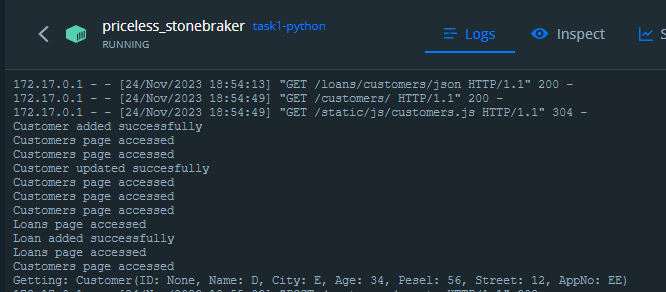

# Zadanie 1

Podatność zapisuje w logach wrażliwe dane. Została znaleziona w zakładce Customers, logi są tworzone przy dodaniu Customera.

# Zadanie 2

1. Weryfikację uruchomiono podaną w README komendą docker run -v ${path_to_host_folder_to_scan}:/path zricethezav/gitleaks:latest detect --source="/path" -v 
2. W commicie bc17b7ddc46f46fff175aed55d68e11bb48166cc znaleziono 2 leaki:
- plik z kluczem deployment.key
- plik z credentials awscredentials.json (wykryty podwójnie)

W commicie de9d7b8cb63bd7ae741ec5c9e23891b71709bc28 znaleziono 1 leak:
- plik z kluczem deployment2.key

Logi gitleaks znajdują się w pliku gitleaks.txt (oczywiście nie jest to najlepszy pomysł umieszczać taki plik w repozytorium, ale jednak sprawozdanie z projektu jest zawarte w repozytorium)

3. Hasła należy przechowywać poza repozytorium, w pliku można jeśli mamy gwarancję, że jest on odpowiednio zabezpieczony lub jako zmienna środowiskowa.

# Zadanie 3

+============================+===========+==========================+==========+
| package                    | installed | affected                 | ID       |
+============================+===========+==========================+==========+
| healpy                     | 1.8.0     | <=1.16.6                 | 61774    |
+==============================================================================+
| Healpy 1.16.6 and prior releases ship with a version of 'libcurl' that has a |
| high-severity vulnerability.                                                 |
+==============================================================================+

Healpy nie jest używane w projekcie, więc nie stanowi zagrożenia, ale jest zawarte w requirements-task.txt, dlatego zostało wykryte. Należy zaktualizować do wersji wyższej niż 1.16.6